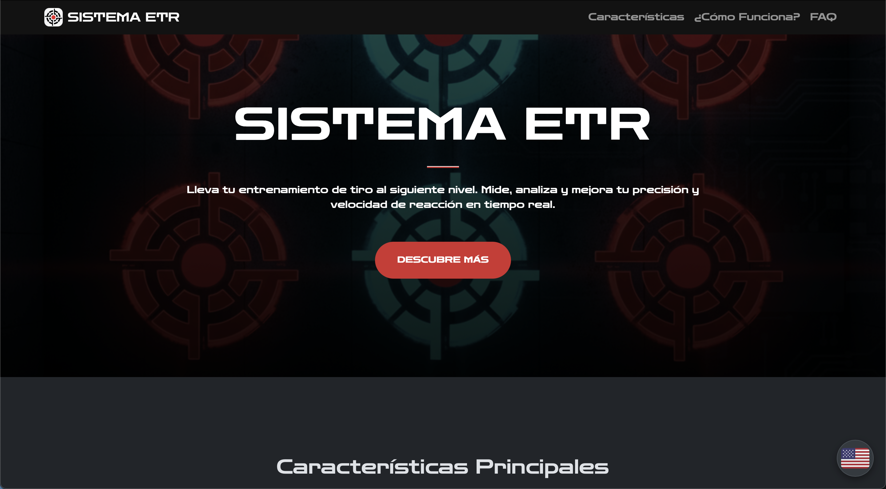

# Sistema ETR - Landing Page

[](LICENSE)

This is the official informational landing page for the **Sistema ETR (Reaction Shooting Training System)** mobile application. It's a fully responsive, static website built to showcase the app's features and provide essential information to users.



---

### About The Project

The goal of this project is to provide a professional, fast, and informative online presence for the Sistema ETR Android app. The website serves as the primary point of contact for potential users, explaining the system's core functionalities, hardware requirements, and providing access to legal documents like the Privacy Policy and Terms of Service.

### Features

* **Fully Responsive Design**: Looks great on desktops, tablets, and mobile devices.
* **Bilingual Content (ES/EN)**: The content can be change between Spanish or English.
* **SEO & Social Media Ready**: Includes a full suite of meta tags (Open Graph, Twitter Cards), a sitemap, and a detailed favicon setup for excellent search engine visibility and social sharing.
* **Firebase Integration**: Uses Firebase Authentication for secure password reset functionality.

---

### Built With

This project was built using a simple and lightweight stack:

* 
* 
* 
* 
* 

---

### File Structure

The project follows a standard structure for static websites to keep content, styles, and scripts organized.

```
/
├── firebase.json       (Firebase hosting config)
├── .firebaserc         (Firebase project mapping)
├── .gitignore          (Files to ignore for Git)
├── LICENSE             (Project license)
├── README.md           (This file)
│
├── /images/            (Images for the README)
│
└── /public/            (All static files for hosting)
    │
    ├── index.html          (Main landing page - ES)
    ├── privacy.html        (Privacy Policy - ES)
    ├── terms.html          (Terms & Conditions - ES)
    ├── 404.html            (Custom 404 error page)
    ├── reset-password.html (Password reset handler page)
    ├── footer.html         (Footer component - ES)
    ├── robots.txt          (Instructions for web crawlers)
    ├── sitemap.xml         (Site map for SEO)
    │
    ├── /en/                (English language content)
    │   ├── index.html
    │   ├── privacy.html
    │   ├── terms.html
    │   └── footer.html
    │
    ├── /assets/
    │   ├── /css/           (Custom styles)
    │   ├── /js/            (Global scripts)
    │   └── /images/        (Site images, logos, hero)
    │
    └── /favicon/           (All website favicons)
        ├── favicon.ico
        ├── apple-touch-icon.png
        ├── site.webmanifest
        └── ... (etc.)
```

---

### License

This is a "source-visible" project, not an open-source one. The code is made public for portfolio and demonstration purposes only. You can check the [`LICENSE`](LICENSE) for more information

**Copyright (c) 2025, Sistema ETR. All Rights Reserved.**